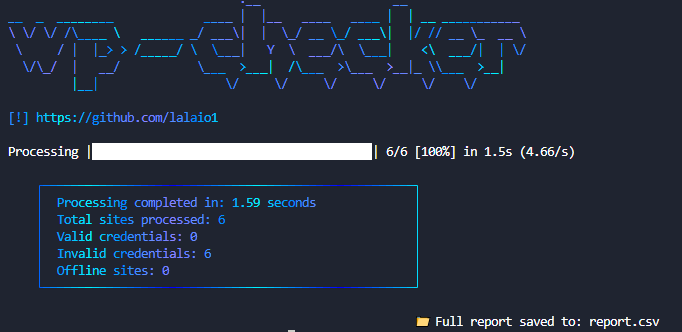

# 🛠️ wp-checker

Welcome to the wp-checker! This tool is designed to efficiently verify WordPress credentials and provide detailed reports. 


---

## 🌟 Features

- ✅ Validates WordPress credentials
- ❌ Identifies invalid credentials
- 🌐 Detects offline sites
- 📊 Generates comprehensive reports in various formats (CSV, JSON, XML, YAML, SQL, Parquet)
- 🛠️ Multi-threaded processing for faster performance
- ⏱️ Configurable delay between requests

## 📸 Screenshots

---


---


--- 


## 📚 Installation

### Windows

1. **Install Python**: Download and install the latest version of Python from [python.org](https://www.python.org/downloads/).
2. **Clone the repository**:
    ```bash
    git clone https://github.com/lalaio1/wp-checker
    cd wp-checker
    ```
3. **Install dependencies**:
    ```bash
    pip install -r requirements.txt
    ```
4. **Run**:
    ```bash
    python wp-checker.py -h
    ```
    
### Linux

1. **Install Python**: Use your package manager to install Python, e.g.,
    ```bash
    sudo apt update
    sudo apt install python3 python3-pip
    ```
2. **Clone the repository**:
    ```bash
    git clone https://github.com/lalaio1/wp-checker
    cd wp-checker
    ```
3. **Install dependencies**:
    ```bash
    pip3 install -r requirements.txt
    ```
4. **Run**:
    ```bash
    python3 wp-checker.py -h
    ```
    
### Mac

1. **Install Python**: Use Homebrew to install Python,
    ```bash
    brew install python
    ```
2. **Clone the repository**:
    ```bash
    git clone https://github.com/lalaio1/wp-checker
    cd wp-checker
    ```
3. **Install dependencies**:
    ```bash
    pip3 install -r requirements.txt
    ```
4. **Run**:
    ```bash
    python3 wp-checker.py -h
    ```
    
### Termux

1. **Install Python**:
    ```bash
    pkg install python3
    pkg install git
    ```
2. **Clone the repository**:
    ```bash
    git clone https://github.com/lalaio1/wp-checker
    cd wp-checker
    ```
3. **Install dependencies**:
    ```bash
    pip install -r requirements.txt
    ```
4. **Run**:
    ```bash
    python3 wp-checker.py -h
    ```

## 🎨 Usage (exemple):

Run the script with the following command:

```bash
python wp-checker.py path/to/your/file -v valid_file -i invalid_file -off offline_file -s -t 10 -o report -f csv -d 0.5
```

### Arguments:

| Argument          | Description                                  | Default     |
|-------------------|----------------------------------------------|-------------|
| `file`            | Path to the file with URLs and credentials  | Required    |
| `-v`, `--valid`   | File to save valid credentials               | None        |
| `-i`, `--invalid` | File to save invalid credentials             | None        |
| `-off`, `--offline` | File to save offline sites                  | None        |
| `-s`, `--skip-ping` | Skip ping check                             | False       |
| `-t`, `--threads` | Number of threads to use                     | 10          |
| `-o`, `--output`  | Output file for the full report              | report      |
| `-f`, `--format`  | Output format for the report                 | csv         |
| `-d`, `--delay`   | Delay between requests in seconds            | 0           |

---

## 📋 File Format

For **wp-checker** to function correctly, the provided `.txt` file must follow the format below:

```
(url):(user):(password)
```

### Example Format:

```
http://example.com/wp-login.php:admin:password123
https://anotherexample.com/wp-login.php:user:mysecurepassword
```

### Format Details:

- **URL**: The WordPress site address you want to check, ending with `wp-login.php`.
- **User**: The username for authentication on the WordPress site.
- **Password**: The password associated with the username.

Each line of the file should contain a set of credentials in the specified format, separated by colons (`:`). Ensure there are no extra spaces around the colons.

---

## 📄 Credits

- **Creator**: [lalaio1](https://github.com/lalaio1)

## 📝 License

This project is licensed under the MIT License - see the [LICENSE](LICENSE) file for details.

## 💬 Contact

For questions or support, please reach out to 
discord: [lalaio1]
github: lalaio1
---
